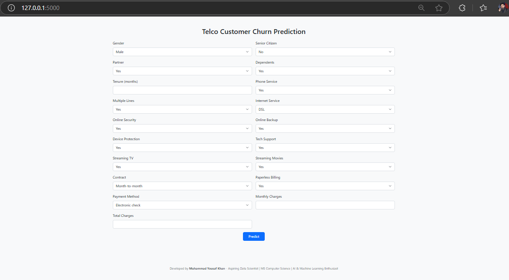
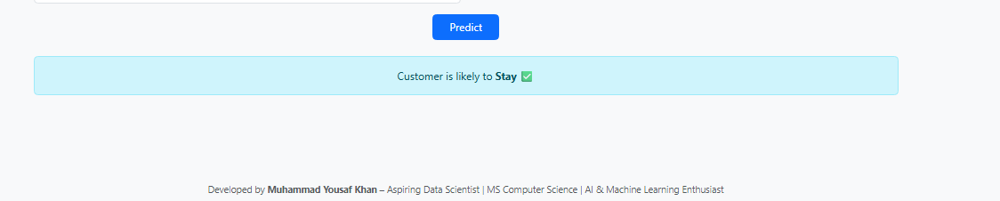
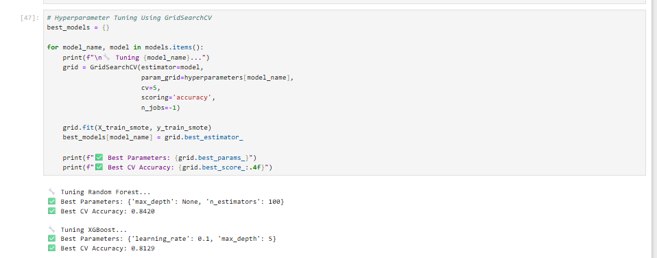

# 📞 Telecom Customer Churn Prediction


A full-stack machine learning project that predicts telecom customer churn using a trained model and serves predictions through a responsive web app built with Flask.

---

## 🚀 Project Overview

Customer churn is a critical metric in the telecom industry. This project leverages machine learning to predict whether a customer will stay or leave, helping businesses take proactive retention measures.

* 🧠 **Model**: Trained using Random Forest and XGBoost (with tuned hyperparameters)
* 🌐 **Deployment**: Flask web application with clean HTML/CSS interface
* 📊 **Dataset**: Includes customer demographics, contract type, charges, and services used

---

## 🧪 Machine Learning Workflow

* ✅ **Data Preprocessing**: Missing value handling, label encoding, feature scaling
* 📊 **EDA**: Visual analysis of churn distribution, numerical distributions, and correlations
* ⚖️ **Class Imbalance Handling**: SMOTE (Synthetic Minority Over-sampling Technique)
* 🧠 **Model Training**: Random Forest, XGBoost Classifier (with GridSearchCV for tuning)
* 📈 **Evaluation Metrics**: Accuracy, Precision, Recall, F1-Score, ROC AUC
* 💾 **Model Serialization**: Saved using `pickle` as `model.pkl`

> Full training code available in: `Telco Customer Churn.ipynb`

---

## 🌐 Flask Web Application

This model is deployed using Flask. The web app allows users to enter customer data via a simple form and returns a prediction on whether the customer will churn or not.

### 🔧 Features

* Real-time prediction using user input
* Clean and responsive UI using HTML/CSS
* Easily extendable with new models or input fields

---

## 📂 Project Structure

```plaintext
telecom-churn-flask-app/
├── app.py
├── model.pkl
├── dataset.csv
├── Telco Customer Churn.ipynb
├── requirements.txt
├── static/
│   └── style.css
├── templates/
│   └── index.html
└── README.md
```

---

## ⚙️ How to Run This Project Locally

1. **Clone the repository**

```bash
git clone https://github.com/yourusername/telecom-churn-flask-app.git
cd telecom-churn-flask-app
```

2. **Create a virtual environment (recommended)**

```bash
python -m venv venv
# On macOS/Linux:
source venv/bin/activate
# On Windows:
venv\Scripts\activate
```

3. **Install dependencies**

```bash
pip install -r requirements.txt
```

4. **Run the Flask app**

```bash
python app.py
```

5. **Open your browser and visit**

```
http://127.0.0.1:5000/
```

---

## ✅ Example Inputs

| Feature         | Example Value    |
| --------------- | ---------------- |
| Gender          | Female           |
| SeniorCitizen   | 0                |
| Partner         | Yes              |
| InternetService | Fiber optic      |
| MonthlyCharges  | 70.35            |
| Tenure          | 12               |
| Contract        | Month-to-month   |
| PaymentMethod   | Electronic check |

---

## 🧰 Technologies Used

* **Languages**: Python, HTML, CSS
* **Libraries**: Pandas, NumPy, Scikit-learn, XGBoost, Imbalanced-learn, Matplotlib, Seaborn, Flask
* **Tools**: Jupyter Notebook, PyCharm, Git, GitHub

---

## 📸 Screenshots

####  Home Page


####  Prediction Result


####  Train Model Accuracy



---

## 🤝 Contributing

Contributions, issues, and feature requests are welcome!
Feel free to check the [issues page](https://github.com/yusiKhan/telecom-churn-flask-app/issues).

---

## 🏷 License

This project is licensed under the MIT License - see the [LICENSE](LICENSE) file for details.

---

## 🙌 Connect With Me

* 🔗 [LinkedIn](https://www.linkedin.com/) *(https://www.linkedin.com/in/yusi/)*
* 📧 Email: [kyusi799@gmail.com](mailto:kyusi799@gmail.com)

---

Made with ❤️ by Muhammad Yousaf Khan
